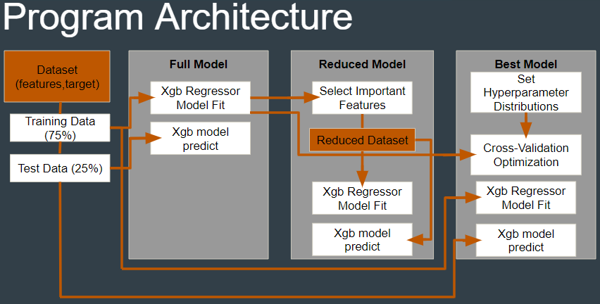

# ME396_G09_Final_Project

## Predicting Large Datasets Using XGBoost
James Wang, Justin Hart, Mobina Tavangarifard

We demonstrate the use of a decision tree ML algorithm in predicting large datasets using the XGBoost library.

## Links
- Project Report: https://docs.google.com/document/d/1RXT-DNYlY3WjcMRRzVr92ZcNn37_6c_yp09cDTvRVfE/edit?usp=sharing 
- Project Presentation: https://docs.google.com/presentation/d/1XiW7GZcUZVbdhYx3ifEzNfSAGtFmcoyo7fH9i1bOLlc/edit?usp=sharing

## Running the Code
### Packages to Install:
- XBGoost - https://xgboost.readthedocs.io/en/stable/install.html#python 
- Numpy - https://numpy.org/install/ 
- Sklearn - https://scikit-learn.org/stable/install.html 
- Matplotlib - https://matplotlib.org/stable/users/installing/index.html 
- Pandas - https://pandas.pydata.org/docs/getting_started/install.html 

### Example Datasets:
CA Housing:
- In CA_Housing folder on the github repo, open CA_Housing_Prediction.py
  - Run this file to see results of predicting a dataset on California median house values
  - To avoid long run times, comment out code for parameter optimized model (best model). This is everything past line 126.
    - To see results of parameter optimized model, run load_best_CA_Housing.py which runs a saved best model
      
Metrology:
- In Metrology folder on the github repo, open ML_test.py
  - Ensure nanosheet_18k.csv is located in the same folder as ML_test.py
  - Run this file to see results of predicting a dataset on metrology measurements
  - To avoid long run times, comment out code for parameter optimized model (best model). This is everything past line 182.
    - To see results of parameter optimized model, run load_best_Metrology.py which runs a saved best model

Function:
- In the Function folder of the github repo, the xgb_func.py file contains a function xgb_pred that can be used to create full, reduced, and best trained models for a set 
  of given input data
  - Inputs: data from dataset to be used in prediction, target from dataset which is the variable to be predicted, column labels of data from dataset, testing data split 
    percentage, True/False to perform parameter optimization to find the best model, dictionary of parameters and range of their values to be optimized over, number of 
    folds in cross-validated parameter optimization, number of parameter settings sampled for parameter optimization
  - Outputs: full, reduced, and best trained models
- The metrology.py, ca_housing.py, and life_expectancy.py, are three scripts with example usage of the xgb_pred function on metrology, California median housing values, and 
  life expectancy data respectively
- Run each of these scripts to see results of predicting a dataset with their respective data using the xgb_pred function.
  - Ensure life_exp_data.csv and nanosheet_18k.csv are located in the same folder as the example scripts
  - Set rand_cv argument to ‘False’ in order to reduce run time by eliminating parameter optimization for best model (will only return full and reduced models in this case)

## Understanding the Results:
### XGBoost Background
- Refer to presentation link above

### Overview

- Program architecture shown in the figure above - used to solve a supervised learning regression problem 
  - First, a dataset which consists of features and target(s) (features are data used to predict target(s)) is split into training and testing data
  - Then, three models are produced on the dataset:
  - Full uses training data to train a XGBoost regression model, then model is used to predict the testing data
  - Reduced selects the features that contribute most to the prediction from the full model. The training data using only these most important features are used to train a 
    XGBoost regression model, and this model is used to predict the testing data
  - Best takes parameter distributions as input and performs a cross-validated search over these parameter distributions to find the best XGBoost regression model 
    parameters. This model is trained using the training data and is then used to predict the testing data
- Output Printed to Screen:
  - Full model training and prediction times
  - Full model metrics (mean absolute error, mean squared error, root mean squared error, r squared, adjusted r squared)
  - Number of most important features for reduced model
  - Reduced model training and prediction times
  - Reduced model metrics
  - Best model training and prediction times
  - Best model metrics
  - Best model chosen parameters after parameter optimization
- Output Plots:
  - Importance scores of dataset features
  - Prediction vs actual values of all targets for full, reduced, and best models
- The function xgb_pred also returns the full, reduced, and best trained models for further manipulation/testing

### Details
- Typically the r squared values and mean absolute error will be higher and lower respectively for the full model vs. reduced model. The advantage in the reduced model, 
  though, is in a typically reduced training time. The difference is minimal for our examples but for a much larger dataset this could save large amounts of time.
- The best model usually has the lowest mean absolute error and highest r squared value of the three models for the best accuracy, but the training time is significantly longer.
- The metrology dataset plots are slightly different due to the nature of the metrology dataset. This dataset has multiple targets (critical dimensions in this case) that are being predicted from the dataset features. These plots compare predicted vs actual values for the set of targets for two different sets of features. This is done for the full model vs reduced model as well as the full model vs best model.  
- The xgb_pred function does not plot any data for datasets with multiple targets due to the difficulty of generalizing plotting of single vs. multiple target datasets
